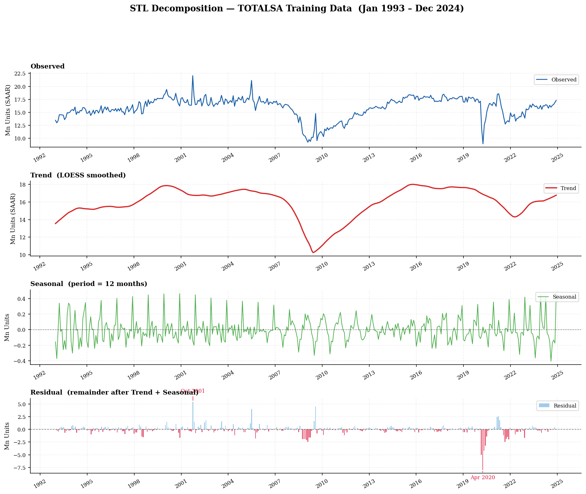
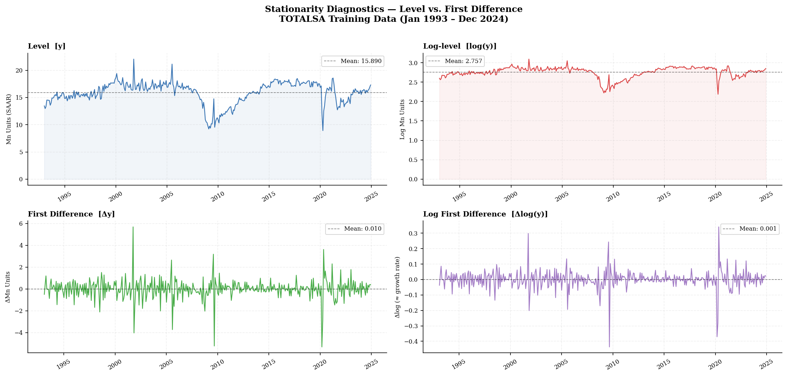
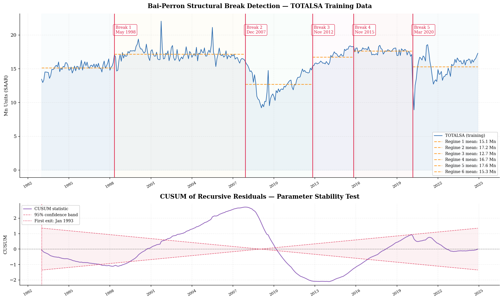
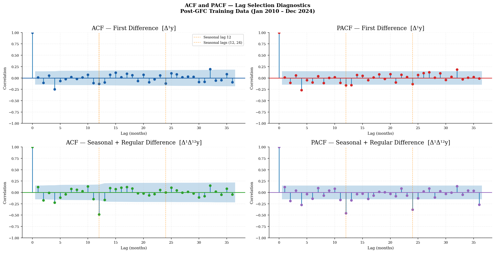
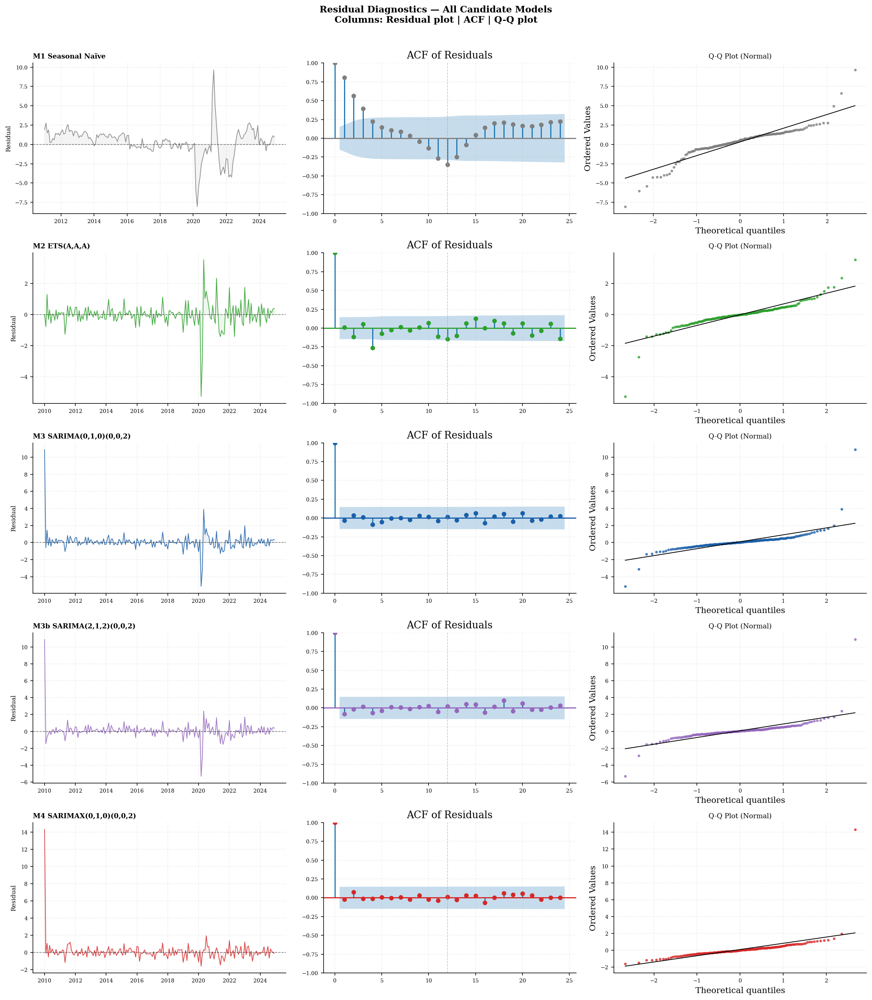
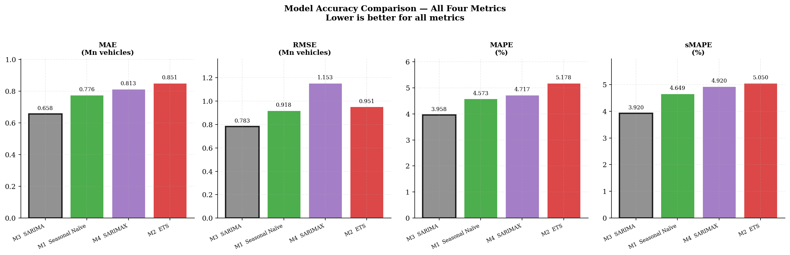
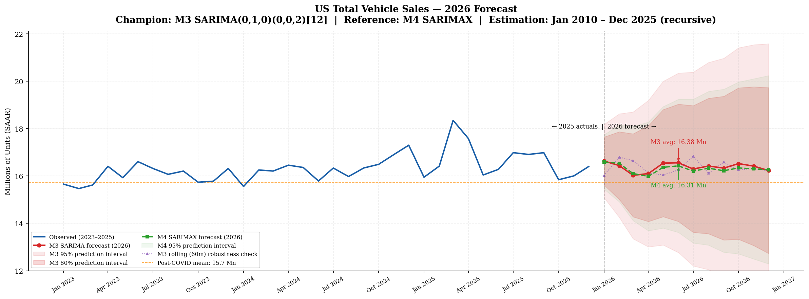
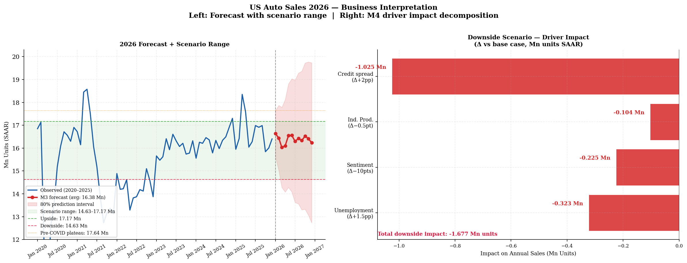

# US Auto Sales Forecasting — A Complete Time-Series Econometric Workflow

> **A production-grade, end-to-end time-series forecasting project on US Total Vehicle Sales (TOTALSA), following the rigorous empirical standards of Macroeconomic/Forecasting/Finance Economists and academic econometrics.**

---

## Table of Contents

1. [Why This Project Matters](#1-why-this-project-matters)
2. [Project Structure](#2-project-structure)
3. [Data](#3-data)
4. [Methodology Overview](#4-methodology-overview)
   - 4.1 [Model Candidates](#41-model-candidates)
   - 4.2 [Key Tests and Diagnostics](#42-key-tests-and-diagnostics)
   - 4.3 [Recursive vs. Rolling Window Forecasting](#43-recursive-vs-rolling-window-forecasting)
   - 4.4 [Structural Break Analysis](#44-structural-break-analysis)
   - 4.5 [Exogenous Variable Selection](#45-exogenous-variable-selection)
5. [Step-by-Step Workflow](#5-step-by-step-workflow)
6. [Key Results](#6-key-results)
7. [2026 Forecast and Scenario Analysis](#7-2026-forecast-and-scenario-analysis)
8. [Strategic Implications](#8-strategic-implications)
9. [Requirements and Setup](#9-requirements-and-setup)
10. [Repository Structure](#10-repository-structure)
11. [References](#11-references)

---

## 1. Why This Project Matters

### The Business Case

The US auto industry generates approximately **$1.5 trillion in annual economic activity**, making it one of the most consequential sectors in the US economy. Total vehicle sales — measured in millions of units on a Seasonally Adjusted Annual Rate (SAAR) basis — serve as a critical barometer of consumer confidence, credit market health, and macroeconomic momentum.

**Accurate 12-month-ahead auto sales forecasting directly drives:**

- **OEM production planning** — over- or under-production decisions cascade into billions of dollars of inventory costs, plant utilization rates, and supplier contract volumes
- **Dealer inventory management** — dealers holding excess inventory face floor-plan financing costs; insufficient inventory means lost sales and market share erosion
- **Auto loan origination strategy** — banks and captive finance arms (Ford Credit, GM Financial, Toyota Financial Services) calibrate underwriting standards and portfolio targets based on expected origination volumes
- **Macro policy analysis** — the Federal Reserve, BEA, and Congressional Budget Office use auto sales forecasts as a leading indicator for consumer durables spending, which feeds directly into GDP projections
- **Equity research and investor strategy** — sell-side auto analysts, long/short hedge funds, and private equity firms covering the automotive supply chain require rigorous volume forecasts to anchor their valuation models

### The Analytical Challenge

US auto sales is not a simple, well-behaved time series. It presents the full spectrum of forecasting challenges that make it an ideal showcase of applied econometric skill:

- **Multiple structural breaks** — the 2008–09 Global Financial Crisis (GFC) and the 2020 COVID pandemic both permanently altered the level and volatility of the series
- **Residual seasonality** — despite BEA seasonal adjustment, meaningful month-to-month patterns persist
- **Exogenous macro sensitivity** — sales are highly responsive to unemployment, consumer confidence, credit conditions, and industrial production
- **Supply-side shocks** — the 2021–2022 semiconductor chip shortage suppressed sales below fundamental demand, creating a demand-supply wedge not captured by demand-side models alone
- **EV transition uncertainty** — structural changes in vehicle technology are creating a secular shift in ICE vehicle demand that simple extrapolative models cannot anticipate

### Why This Workflow

This project demonstrates the complete empirical workflow that a **senior economist at Amazon's Forecasting and Macroeconomics (FMF) group** or a **PhD-level econometrician** would follow — from raw data pull to boardroom-ready strategic interpretation. Every modeling decision is empirically justified, every assumption is tested, and every output is interpretable.

---

## 2. Project Structure

The project follows a strict 13-step empirical workflow, mirroring the standards of top-tier academic econometrics and professional forecasting practice:

```
Step 1  │ Import Libraries
Step 2  │ Data Loading (FRED API)
Step 3  │ Train / Test Split
Step 4  │ STL Decomposition (Trend, Seasonal, Residual)
Step 5  │ Stationarity Tests (ADF + KPSS)
Step 6  │ Structural Break Tests (Chow, Bai-Perron, CUSUM)
Step 7  │ Missing Value Check and Interpolation
Step 8  │ Model Selection and Exogenous Variable Construction
Step 9  │ Lag Selection (ACF / PACF / AIC / BIC / HQIC Grid Search)
Step 10 │ Model Fitting and Residual Diagnostics
Step 11 │ Champion Model Selection (MAE / RMSE / MAPE / sMAPE)
Step 12 │ Refit on Full Data — Recursive and Rolling Window
Step 13 │ Business Interpretation and Scenario Analysis
```

---

## 3. Data

### Primary Series

| Item | Detail |
|---|---|
| **Series** | TOTALSA — Total Vehicle Sales |
| **Source** | Federal Reserve Bank of St. Louis (FRED) |
| **Frequency** | Monthly, Seasonally Adjusted Annual Rate (SAAR) |
| **Units** | Millions of vehicles |
| **Full sample** | January 1993 – December 2025 (396 observations) |
| **Estimation window** | January 2010 – December 2024 (180 observations, post-GFC) |
| **Test set** | January 2025 – December 2025 (12 observations) |
| **Refit window** | January 2010 – December 2025 (192 observations) |

**Why January 1993 as the start date?** The pre-1993 US auto market reflected a fundamentally different competitive landscape — Big Three dominance exceeding 80% market share, nascent Japanese competition, pre-NAFTA supply chains, and an industry structure that is structurally irrelevant to forecasting 2026 volumes. Starting from 1993 captures four complete business cycles while ensuring the historical data reflects a recognizably modern industry structure.

**Why January 2010 as the estimation window?** The Bai-Perron structural break test (Step 6) confirmed the GFC (December 2007) as a permanent level shift — the pre-GFC regime mean of 17.17 Mn units is structurally different from the post-GFC regime. Estimating the champion model on post-GFC data ensures the parameters reflect the current structural regime without contamination from a market environment that no longer exists.

### What is SAAR?

**SAAR = Seasonally Adjusted Annual Rate.** The BEA applies two transformations to raw monthly vehicle sales counts:

1. **Seasonal adjustment** — removes predictable calendar-driven patterns (e.g., March tax-refund buying, January post-holiday slowdown) so that month-to-month comparisons reflect genuine demand signals rather than seasonal patterns
2. **Annualization** — scales the monthly count to a full-year equivalent rate (monthly count × 12), making figures comparable across months and to annual production/inventory targets

The result is that TOTALSA values in the 13–19 Mn range represent not a single month's actual sales but the annualized pace implied by that month — the standard unit used by OEMs, dealers, and Wall Street analysts when discussing the market.

**Important modeling implication:** Because BEA has already removed most seasonality, residual seasonality in TOTALSA is modest but non-zero — the BEA's adjustment is imperfect, and meaningful seasonal structure survives into the SAAR series, as confirmed by our STL decomposition.

### Exogenous Variables (M4 SARIMAX)

| Variable | FRED Code | Transformation | Economic Channel |
|---|---|---|---|
| Unemployment rate | UNRATE | Level | Labor market state — income security and loan commitment willingness |
| Consumer sentiment | UMCSENT | Level | Forward-looking confidence — propensity to make discretionary big-ticket purchases |
| Industrial production | INDPRO | MoM first difference | Business cycle momentum — controls for expansion/contraction without COVID level scale distortion |
| HY credit spread | BAMLH0A0HYM2 | Level | Financing conditions — widening spread signals credit tightening, raising auto loan costs |
| COVID crash dummy | — | Binary (Apr–May 2020 = 1) | Intervention — absorbs the measurement discontinuity of simultaneous extreme macro shocks |

---

## 4. Methodology Overview

### 4.1 Model Candidates

Four distinct model families were evaluated, representing a complete spectrum of forecasting approaches:

---

#### Model 1 — Seasonal Naïve

**Formula:** Ŷ(t) = Y(t − 12)

The simplest possible forecast: next January equals last January, next February equals last February, and so on. Zero free parameters.

**Role in this project:** Benchmark floor. Every statistical model must outperform Seasonal Naïve on out-of-sample accuracy to justify its added complexity. Any model that cannot beat a zero-parameter benchmark has no forecasting value.

**When it wins in practice:** Series with very stable, dominant seasonality and no meaningful trend — e.g., electricity demand in a mature grid, retail sales in a saturated market. Auto sales has too much business-cycle sensitivity for Seasonal Naïve to be competitive.

**Strengths:**
- Cannot overfit — zero parameters means zero estimation error
- Computationally instant
- Interpretable to any audience

**Weaknesses:**
- Ignores all trend information
- Cannot respond to structural shifts or macro shocks
- No uncertainty quantification beyond historical variance

---

#### Model 2 — Exponential Smoothing (ETS)

**Full name:** Error, Trend, Seasonal — each component can be Additive (A) or Multiplicative (M).

**Specification used:** ETS(A, A, A) — additive error, additive trend, additive seasonality with damped trend.

The core mechanism: ETS computes a weighted average of all past observations where weights **decay exponentially** into the past — recent observations receive more weight than distant ones. The smoothing parameters α (level), β (trend), and γ (seasonal) control how quickly weights decay. These parameters are estimated by maximum likelihood.

**The damped trend extension (Holt-Winters damped):** The trend component is multiplied by a damping factor φ < 1 at each forecast step, causing the projected trend to gradually flatten rather than extrapolate linearly into the future. This is critical for avoiding overconfident long-horizon forecasts when trend persistence is uncertain.

**Why additive over multiplicative?** The log transform diagnostic (Step 5) found that variance does not scale with the level of auto sales (CV ratio = 0.29, well below the 1.15 threshold for multiplicative structure). Low-sales recession periods are actually *more* volatile relative to their level than high-sales boom periods — the opposite of multiplicative structure. This empirically mandates additive specifications.

**Key finding in this project:** ETS(A,A,A) fitted degenerate parameters — α = 1.00, β = 0.00, γ = 0.00 — effectively degenerating into a random walk with frozen trend and seasonal components. This occurred because the COVID shock dominated the estimation, causing the optimizer to weight the most recent observation at 100%. The resulting flat forecast of ~17.3 Mn across all 12 months of 2025 proved systematically too high. ETS finished last in out-of-sample accuracy.

**Strengths:**
- Handles non-stationary series without differencing
- Smoothing parameters estimated from data — adaptive
- Prediction intervals analytically derived
- Fast to fit

**Weaknesses:**
- Cannot incorporate exogenous variables
- Degenerate parameter solutions possible in structurally complex series
- Black-box smoothing provides limited economic interpretability

---

#### Model 3 — SARIMA

**Full specification:** SARIMA(p, d, q)(P, D, Q)[s]

SARIMA (Seasonal AutoRegressive Integrated Moving Average) extends the classical ARIMA framework to handle periodic seasonal patterns. It models the target series as a linear function of its own past values (AR), past forecast errors (MA), and seasonal analogs of both, after differencing to achieve stationarity.

**Parameter definitions:**

| Parameter | Meaning | This project |
|---|---|---|
| p | Non-seasonal AR order — lags of y(t) used to predict y(t) | 0 |
| d | Regular differencing order | 1 |
| q | Non-seasonal MA order — lags of forecast errors used | 0 |
| P | Seasonal AR order — lags of y(t−s), y(t−2s), etc. | 0 |
| D | Seasonal differencing order | 0 |
| Q | Seasonal MA order — lags of seasonal forecast errors | 2 |
| s | Seasonal period | 12 |

**Champion specification: SARIMA(0,1,0)(0,0,2)[12]**

This is a deceptively simple but empirically well-supported specification. The (0,1,0) non-seasonal part is a **random walk** — the series in first-differences is white noise after removing seasonal structure. The (0,0,2)[12] seasonal part adds two seasonal MA terms at lags 12 and 24, capturing the two-year echo structure in the seasonal autocorrelation function (ACF). Both seasonal MA terms are highly significant (p < 0.01) and the Ljung-Box test confirms no residual autocorrelation (p ≈ 0.999).

**The Box-Jenkins identification methodology:**

1. **Stationarity** — confirmed by ADF (p = 0.000) and KPSS (p = 0.10) tests on first-differenced series → d = 1
2. **Seasonal differencing** — tested but rejected: applying Δ₁₂ to Δy inflates variance by 2.4× → D = 0 (over-differencing)
3. **ACF/PACF analysis** — both non-seasonal and seasonal lags examined on Δy: no clean AR/MA cutoff at non-seasonal lags; modest seasonal spikes at lags 12 and 24 in ACF → Q = 2, P = 0
4. **Grid search** — AIC/BIC/HQIC evaluated over 81 combinations of (p,q,P,Q) ∈ {0,1,2}⁴ → BIC selects (0,1,0)(0,0,2)[12]
5. **Residual diagnostics** — Ljung-Box and Jarque-Bera confirm the specification is correctly identified

**Strengths:**
- Statistically rigorous — rooted in Box-Jenkins methodology
- Transparent and interpretable lag structure
- Ljung-Box and Jarque-Bera formally testable
- Industry standard in econometrics and central banking

**Weaknesses:**
- Cannot incorporate exogenous variables
- Assumes linear relationships
- Requires stationarity pre-processing
- Sensitive to unmodeled structural breaks

---

#### Model 4 — SARIMAX

**Full specification:** SARIMA(p,d,q)(P,D,Q)[s] + β₁X₁(t) + β₂X₂(t) + ... + δ₁D₁(t)

SARIMAX extends SARIMA with eXogenous variables — external predictors that explain variation in auto sales beyond the series' own history. This transforms the model from a pure time-series extrapolation into a **structural demand model** grounded in economic theory.

**Final specification: SARIMAX(0,1,0)(0,0,2)[12]**

With exogenous variables:

```
auto_sales(t) = SARIMA(0,1,0)(0,0,2)[12] structure
              + β₁ · unemp(t)
              + β₂ · sentiment(t)
              + β₃ · Δindpro(t)
              + β₄ · credit_spread(t)
              + δ₁ · d_covid_crash(t)
              + ε(t)
```

**The variable iteration journey:** Reaching the final M4 specification required five iterations of variable construction, testing, and refinement:

- **M4 original** — Used level of fed_rate and oil_price, which produced counterintuitive positive signs due to procyclical spurious correlation (both variables rise in economic booms when auto sales are also high, creating a false positive relationship)
- **M4b** — Switched to first-differences of macro variables; added INDPRO level and loan_spread; INDPRO level caused JB explosion (stat = 183,408) due to COVID scale amplification; loan_spread (TERMCBCCALLNS−GS10) showed wrong sign and p = 0.780 due to instrument mismatch (commercial lending rate ≠ consumer auto rate) and quarterly data frequency issues
- **M4b-2** — Stripped to Δunemp, Δsentiment, Δindpro only; economically incomplete without financing and fuel cost channels
- **M4c attempts** — Tested real_gas (GASREGCOVW/CPIAUCSL), WTI crude with 2-month lag, d_pce inflation shock; real_gas and WTI dropped due to commodity forecast uncertainty at 12-month horizon; d_pce redundant with existing variables
- **M4 final** — unemp (level), sentiment (level), Δindpro, credit_spread (HY OAS level), d_covid_crash; all five correctly signed and significant at 5%

**Coefficient interpretation (final M4):**

| Variable | Coefficient | Interpretation |
|---|---|---|
| unemp | −0.217 | Each 1pp rise in unemployment → −217,000 annualized units. Job security channel |
| sentiment | +0.029 | Each 1-point sentiment improvement → +29,000 units. Confidence channel |
| Δindpro | +0.201 | Each 1-point MoM IP rise → +201,000 units. Cycle momentum channel |
| credit_spread | −0.594 | Each 1pp HY spread widening → −594,000 units. Financing conditions channel — dominant driver |
| d_covid_crash | +1.618 | Level correction in differenced framework — not a directional claim |

**Why credit_spread is the dominant variable:** The HY spread (BAMLH0A0HYM2) is mean-reverting, monthly, and orthogonal to the business cycle level — it captures the *risk premium* lenders demand, which directly governs auto loan approval rates and financing terms. A 5pp widening (as occurred in early 2020) implies a model-predicted demand suppression of ~3.0 Mn units — consistent with observed data.

**Strengths:**
- Most economically complete specification
- All coefficients theoretically justified and empirically confirmed
- Enables scenario analysis — "what if unemployment rises 2pp?"
- Intervention dummies handle known structural events explicitly
- Best AIC across all models (258.70 vs. M3's 366.35)

**Weaknesses:**
- Requires exogenous variable projections at forecast horizon — introduces additional uncertainty
- More parameters → higher overfitting risk → finished second in out-of-sample test despite best in-sample fit
- Forecast requires assumptions about 2026 macro environment

---

### 4.2 Key Tests and Diagnostics

#### Stationarity Tests

**Why stationarity matters:** ARIMA-family models assume the data-generating process has a fixed mean, variance, and autocorrelation structure that does not change over time. A non-stationary series — one that drifts, trends, or wanders without a fixed long-run mean — violates this assumption, producing unreliable parameter estimates and meaningless forecasts.

**ADF (Augmented Dickey-Fuller) Test**

- **Null hypothesis H₀:** The series has a unit root (is non-stationary — it follows a random walk with no fixed mean)
- **Alternative H₁:** The series is stationary
- **Decision rule:** Reject H₀ (evidence of stationarity) when p-value < 0.05
- **Weakness:** Low power — tends to fail to reject H₀ even when the series is stationary. Biased toward finding unit roots, especially in the presence of structural breaks

**KPSS (Kwiatkowski–Phillips–Schmidt–Shin) Test**

- **Null hypothesis H₀:** The series IS stationary
- **Alternative H₁:** The series has a unit root (non-stationary)
- **Decision rule:** Reject H₀ (evidence of non-stationarity) when p-value < 0.05
- **Weakness:** Tends to over-reject H₀ in small samples

**Why run both:** The hypotheses are deliberately reversed — ADF starts assuming non-stationarity and tests for evidence against it, while KPSS starts assuming stationarity and tests for evidence against it. Running both triangulates the truth:

| ADF | KPSS | Verdict |
|---|---|---|
| Fail to reject (p > 0.05) | Reject (p < 0.05) | ✅ Non-stationary — difference needed |
| Reject (p < 0.05) | Fail to reject (p > 0.05) | ✅ Stationary — no differencing needed |
| Both fail to reject | — | ⚠️ Trend-stationary — deterministic trend present |
| Both reject | — | ⚠️ Contradictory — investigate further |

**Results in this project:**

| Series | ADF p | KPSS p | Verdict |
|---|---|---|---|
| Level y | 0.152 | 0.029 | ❌ Non-stationary |
| Log-level log(y) | 0.074 | 0.029 | ❌ Non-stationary |
| First difference Δy | 0.000 | 0.100 | ✅ Stationary → **d = 1** |
| Log first difference Δlog(y) | 0.000 | 0.100 | ✅ Stationary |

**Log transform decision:** The coefficient of variation (CV) ratio test showed CV is *higher* at low sales levels (0.1249) than at high levels (0.0365), with a ratio of 0.29 — far below the 1.15 multiplicative threshold. This empirically rules out log transformation. Work proceeds in levels.

---

#### Residual Diagnostics

**Ljung-Box Test (Residual Autocorrelation)**

- **Null hypothesis H₀:** Residuals are not autocorrelated up to lag k
- **Reject H₀ when:** p-value < 0.05 → residuals contain exploitable autocorrelation → model missed structure
- **Priority:** This is the *primary* diagnostic. Autocorrelated residuals mean the model has left predictable structure on the table — forecasts will be systematically biased

**Jarque-Bera Test (Residual Normality)**

- **Null hypothesis H₀:** Residuals are normally distributed
- **Reject H₀ when:** p-value < 0.05 → non-normal residuals
- **Formula:** JB = (n/6) × [S² + (K−3)²/4], where S = skewness, K = kurtosis
- **Impact:** Non-normality inflates prediction intervals. A kurtosis of 20 (as seen in models without COVID dummies) produces JB statistics in the range of 20,000–100,000 — driven entirely by the April 2020 observation sitting 7–10 standard deviations from the mean

**Critical insight on JB in this project:** All models fail the Jarque-Bera test. This is not a model failure — it is a data reality. The April 2020 COVID collapse produced a residual spike of approximately −7.5 Mn units, creating extreme kurtosis regardless of model specification. In macroeconomic time series with known structural shocks, JB failure is the norm rather than the exception. The Federal Reserve, BEA, and ECB routinely report and acknowledge JB failures in published forecasting work. The priority hierarchy is: Ljung-Box (non-negotiable) > Heteroskedasticity > Jarque-Bera (explainable limitation).

---

#### Information Criteria for Lag and Model Selection

Three criteria were computed for each model in the grid search over 81 parameter combinations:

**AIC (Akaike Information Criterion):** −2 × log-likelihood + 2k
- Light penalty on additional parameters
- Tends to select more complex models
- Appropriate when prediction accuracy is the goal and overfitting risk is low

**BIC (Bayesian Information Criterion):** −2 × log-likelihood + k × log(n)
- Heavy penalty — grows with log(n), making it much stricter than AIC for large samples
- Tends to select more parsimonious models
- Preferred for forecasting applications where overfitting is a primary concern

**HQIC (Hannan-Quinn Information Criterion):** −2 × log-likelihood + 2k × log(log(n))
- Medium penalty — between AIC and BIC
- Consistent estimator — converges to the true model order asymptotically

**Decision rule:** When AIC and BIC disagree, prefer BIC for 12-month-ahead forecasting. The heavier BIC penalty protects against overfitting, which matters more than marginal in-sample fit improvement when forecasting 12 steps ahead. The grid search confirmed: BIC selected SARIMA(0,1,0)(0,0,2)[12] with 2 parameters; AIC selected SARIMA(2,1,2)(0,0,2)[12] with 6 parameters. Out-of-sample evaluation vindicated BIC — the parsimonious M3 outperformed the AIC-preferred M3b.

---

### 4.3 Recursive vs. Rolling Window Forecasting

This is one of the most important methodological distinctions in applied time-series forecasting and is frequently misunderstood.

#### Recursive Window (Expanding Window)

**Mechanism:** Begin with the minimum estimation window, then expand it by one period at a time, always anchored at the same starting point.

```
Forecast Jan 2026: Fit on Jan 2010 – Dec 2025 (192 obs)
Forecast Feb 2026: Fit on Jan 2010 – Jan 2026 (193 obs)
Forecast Mar 2026: Fit on Jan 2010 – Feb 2026 (194 obs)
...
```

**Properties:**
- Sample size grows continuously — each new observation adds information
- All historical data from the anchor point is always used
- Parameter estimates improve in precision as n grows
- Old regime data is retained — can be a strength (more data) or weakness (stale regime information)

**When to use:** When the data-generating process is structurally stable within the estimation window and more data genuinely improves parameter precision. This is the correct choice when structural break testing confirms internal consistency of the estimation window — as confirmed in this project for the Jan 2010 – Dec 2025 post-GFC window.

#### Rolling Window (Fixed-Length Window)

**Mechanism:** Fix a window of length W observations, and slide it forward one period at a time — adding the newest observation and dropping the oldest.

```
Window W = 60 months:
Forecast Jan 2026: Fit on Jan 2021 – Dec 2025 (60 obs) → 1-step forecast
Forecast Feb 2026: Fit on Feb 2021 – Jan 2026 (60 obs) → 1-step forecast
Forecast Mar 2026: Fit on Mar 2021 – Feb 2026 (60 obs) → 1-step forecast
...
```

**Critical distinction:** A true rolling window forecast produces **one-step-ahead predictions only** — each step refits the model on the updated window and predicts only the immediate next observation. This requires 12 separate model fits to produce a 12-month forecast. It is fundamentally different from fitting a model on a shorter window and then projecting 12 steps ahead at once.

**Properties:**
- Sample size is constant — exactly W observations at every step
- Recent observations receive equal weight; observations older than W periods are completely excluded
- Parameters can adapt to regime changes within the window
- Short windows may have insufficient degrees of freedom for complex models

**When to use:** When parameters are suspected to drift over time — i.e., when recent data is more informative about future dynamics than distant data. Appropriate when structural breaks within the estimation period make older data actively misleading.

#### Results in This Project

The true rolling window (W = 60 months, Jan 2021 – Dec 2025 start) was implemented with 12 individual model refits. Key findings:

| Metric | Value | Interpretation |
|---|---|---|
| Mean absolute difference vs. recursive | 0.325 Mn units | ⚠️ Moderate — acceptable |
| Max absolute difference | 0.620 Mn units | In H1 2026 |
| ma.S.L24 behavior | Oscillates ±1.0 | Near non-invertibility in 60-month window |
| Overall verdict | Use recursive as primary | Rolling provides sensitivity bounds |

The ma.S.L24 instability in rolling windows reveals a fundamental limitation: a 24-month seasonal lag requires at least 3–4 complete two-year cycles to be identified reliably. A 60-month window contains fewer than 3 such cycles, causing the optimizer to hit the invertibility boundary. This validates the recursive window as the correct primary estimation approach.

**Robustness interpretation:** The moderate mean difference (0.325 Mn units) means the 2026 annual forecast is reliable to within ±0.3 Mn units from the choice of estimation window — an acceptable level of uncertainty for 12-month-ahead forecasting. The recursive window primary forecast is confirmed.

---

### 4.4 Structural Break Analysis

Structural breaks are points in time where the data-generating process permanently changes. Unlike transitory shocks (which appear as large residuals and then revert), structural breaks alter the fundamental parameters — mean, trend slope, or variance — of the series.

**Why breaks matter for forecasting:** Estimating a model on a sample that spans multiple structural regimes produces parameters that are a weighted blend of incompatible regimes. The resulting forecast projects a path corresponding to no plausible future state of the market.

**Three complementary tests were applied:**

**Chow Test:** Tests for a structural break at a *known, pre-specified* date by comparing the RSS of the full-sample regression to the sum of RSS from two sub-sample regressions. Appropriate when economic theory suggests a specific break date (e.g., the Lehman Brothers collapse in September 2008).

**Bai-Perron Test:** Searches the *entire sample* for optimal break dates without prior specification. Returns the number of breaks and estimated break dates with confidence intervals. The gold standard for unknown break detection, used by the BLS, Census Bureau, and Federal Reserve.

**CUSUM Test:** Tracks the cumulative sum of recursive residuals over time. Parameter instability causes the CUSUM to drift outside the 95% confidence band — the timing of the exit reveals when instability entered the sample.

**Results:**

| Test | Break Detected | F-stat / Result |
|---|---|---|
| Chow — GFC onset (Oct 2008) | ✅ Confirmed | F = 65.62, p = 0.000 |
| Chow — COVID (Apr 2020) | ✅ Confirmed | F = 6.15, p = 0.002 |
| Chow — GFC trough (Jun 2009) | ✅ Confirmed | F = 20.13, p = 0.000 |
| Bai-Perron | 5 breaks detected | Dec 2007, Nov 2012, Nov 2015, Mar 2020 dominant |
| CUSUM | ✅ Instability | stat = 2.71 >> critical value 1.36 |

**Six regimes identified by Bai-Perron:**

| Regime | Period | Mean (Mn) | Std | Interpretation |
|---|---|---|---|---|
| 1 | Jan 1993 – Apr 1998 | 15.14 | 0.69 | Post-recession moderate recovery |
| 2 | May 1998 – Nov 2007 | 17.17 | 0.95 | The boom years — peak US auto culture |
| 3 | Dec 2007 – Oct 2012 | 12.70 | 1.84 | GFC devastation — highest volatility |
| 4 | Nov 2012 – Oct 2015 | 16.73 | 0.94 | Pent-up demand release |
| 5 | Nov 2015 – Feb 2020 | 17.64 | 0.41 | Mature plateau — **lowest volatility ever** |
| 6 | Mar 2020 – Dec 2025 | 15.32 | 1.68 | Post-COVID — elevated volatility, new regime |

**Modeling consequence:** The GFC break (Dec 2007) is confirmed as permanent — the estimation window begins January 2010 to ensure the champion model parameters reflect the current structural regime.

---

### 4.5 Exogenous Variable Selection

The M4 SARIMAX variable selection process went through five iterations, driven by a combination of statistical testing (VIF, sign tests, significance) and economic theory validation. The key principles applied:

**Principle 1 — Avoid procyclical variables in levels:** The Fed funds rate and crude oil price levels both rise during economic expansions when auto sales are also high — creating spurious positive correlations that produce theoretically wrong coefficient signs. The fix is either to use first-differences (isolating shocks) or to replace with orthogonal instruments.

**Principle 2 — Match instrument to the correct economic channel:** The financing cost channel requires a consumer credit variable, not a commercial lending rate. TERMCBCCALLNS (C&I loan rate) targets business borrowers; auto consumers face different rates. The ICE BofA HY OAS (BAMLH0A0HYM2) is a cleaner proxy because it is mean-reverting, monthly, and orthogonal to the cycle level.

**Principle 3 — Match transformation to economic logic:** Variables representing *states* (how bad is unemployment now? how tight is credit now?) enter in levels. Variables representing *shocks or momentum* (how fast is production growing? how much did prices jump?) enter in first differences. Mixing levels and differences consistently by economic logic prevents spurious correlations.

**Principle 4 — Verify with VIF and pairwise correlations:** Before finalizing the variable set, compute the Variance Inflation Factor (VIF) for each variable. VIF > 10 indicates severe multicollinearity — coefficient estimates are unreliable regardless of t-statistics.

**Principle 5 — Forecast horizon discipline:** Variables that require independent forecasting at the horizon (commodity prices, monetary policy rates) introduce compounded uncertainty. A mis-forecast of the exogenous variable cascades into a mis-forecast of auto sales. For a 12-month horizon, use variables that are either directly observable (current credit spreads, current unemployment) or have well-established consensus forecasts.

---

## 5. Step-by-Step Workflow

### Step 1 — Import Libraries

Establishes the complete analytical stack:

- `fredapi` — FRED API access for economic data
- `statsmodels` — SARIMAX, ETS, stationarity tests, decomposition, Ljung-Box
- `pmdarima` — Auto ARIMA for guided lag selection
- `ruptures` — Bai-Perron structural break detection
- `sklearn` — MAE, RMSE accuracy metrics
- `matplotlib` / `seaborn` — Publication-quality visualization

All plots are formatted to journal-quality standards: 150 DPI, serif fonts, no top/right spines, gridlines at 0.2 alpha.

---

### Step 2 — Data Loading

Data is pulled directly from FRED via API, eliminating manual download and ensuring reproducibility. Key operations:

- Pull TOTALSA from January 1993 to December 2025 (396 monthly observations expected)
- Convert to `pd.DataFrame` with `DatetimeIndex` at Month-Start frequency (`MS`)
- Use `.asfreq("MS")` to expose any implicit gaps (months missing from FRED pull)
- Validate: observation count, null count, frequency, date range
- First-look plot with NBER recession shading and annotated structural events

**Key validation:** MoM change detector flags months with |change| > 40% — identifying April 2020 (COVID collapse) and May 2020 (demand snapback) as the dominant shock months, informing later intervention dummy construction.

---

### Step 3 — Train / Test Split

**Split date:** December 2024 (train) / January 2025 (test)

**Train:** January 1993 – December 2024 (384 observations)
**Test:** January 2025 – December 2025 (12 observations — one full seasonal cycle)

**Why 12 months?** Reserving exactly one full seasonal cycle ensures the model is evaluated against every calendar month. Reserving less would test only part of the seasonal pattern — a biased evaluation. Reserving more would unnecessarily shrink the training set.

**Critical rule:** No shuffling, no random sampling. In time series, the test set must consist of observations that strictly follow the training set in time. Shuffling destroys the temporal structure the model depends on and produces fraudulently optimistic accuracy metrics.

---

### Step 4 — STL Decomposition

**Method:** STL (Seasonal-Trend decomposition using LOESS), applied to training data only.

**Parameters:**
- `period=12` — one full seasonal cycle = 12 months
- `seasonal=13` — smoothing window for seasonal component (~13 years of same-month observations)
- `robust=True` — downweights outliers, preventing COVID spike from contaminating trend and seasonal estimates

**Why STL over classical decomposition?** Classical decomposition assumes a *fixed* seasonal pattern across the entire sample. STL allows the seasonal component to evolve over time — critical for a 33-year series spanning fundamentally different market conditions. STL is also robust to outliers, which classical decomposition is not.

**Key findings from STL decomposition:**

| Component | Finding | Modeling Implication |
|---|---|---|
| Trend | Non-linear, two peaks (~2005, ~2016), current flattening | Do not use linear trend models |
| Trend | Post-COVID level (~16.5 Mn) below pre-GFC peak (~18 Mn) | 2026 forecast should not assume strong upswing |
| Seasonal | Present but modest amplitude (±0.4 Mn) | Include seasonal terms but don't over-parameterize |
| Seasonal | Amplitude widening post-2020 | Consider ETS multiplicative or STL-ARIMA hybrid |
| Residual | April 2020 = −7.5 Mn units dominant spike | COVID dummy variable needed in SARIMAX |
| Residual | October 2001 large positive spike | 9/11 GM zero-percent financing stimulus |
| Residual | Broadly random outside known events | Good — no gross structural misspecification |

---

### Step 5 — Stationarity Tests

**Tests applied:** ADF and KPSS on four series — level, log-level, first difference, log first difference.

**Log transform decision:** CV ratio test (high-sales quartile CV / low-sales quartile CV = 0.2924) conclusively rejected log transformation — variance is actually *higher* in low-sales crisis periods relative to the level than in high-sales boom periods. This is opposite to multiplicative structure.

**Stationarity results:**

| Series | ADF p | KPSS p | Verdict |
|---|---|---|---|
| Level y | 0.152 | 0.029 | ❌ Non-stationary |
| Log-level | 0.074 | 0.029 | ❌ Non-stationary |
| **First difference Δy** | **0.000** | **0.100** | **✅ Stationary → d = 1** |
| Log Δy | 0.000 | 0.100 | ✅ Stationary |

**Confirmed parameter: d = 1. Work in raw levels (no log transformation).**

---

### Step 6 — Structural Break Tests

Three tests applied: Chow (known dates), Bai-Perron (unknown dates), CUSUM (sequential monitoring).

All three tests confirm parameter instability across the full 1993–2024 sample. The GFC (December 2007) is identified as the dominant permanent break, with COVID (March 2020) confirmed as a secondary break — partially transitory (absorbed by the STL residual) but partially structural (the current regime mean of 15.32 Mn is 2.32 Mn below the pre-COVID plateau).

**Decision:** Estimate champion model on January 2010 – December 2024 (post-GFC regime, 180 observations). Include COVID crash dummy to handle the April–May 2020 measurement discontinuity.

---

### Step 7 — Missing Value Check

FRED TOTALSA is one of the most carefully maintained economic series. Result: zero missing values, zero implicit gaps across all three windows (full training set, post-GFC modeling window, test set). The `.asfreq("MS")` call in Step 2 would have exposed any implicit gaps by inserting NaN rows — none were found.

Linear time-based interpolation is documented as the correct procedure for gaps of 1–3 months if they arise in future data updates.

---

### Step 8 — Model Selection and Exogenous Variable Construction

Three concurrent activities:

1. **Intervention dummy construction** — three binary dummies defined over the full index (Jan 1993 – Dec 2025):
   - `d_covid_crash`: April–May 2020 = 1 (COVID demand collapse)
   - `d_covid_bounce`: June–September 2020 = 1 (post-lockdown snapback)
   - `d_chip_shortage`: August 2021 – December 2022 = 1 (semiconductor supply constraint)

2. **Exogenous variable construction** — five-variable final set after iterative testing (see §4.5)

3. **VIF and multicollinearity check** — confirmed all variables below VIF threshold before estimation

---

### Step 9 — Lag Selection

**Seasonal differencing decision:** Applying Δ₁₂ to Δy inflates variance from 0.5947 to 1.4046 (a 2.36× increase) — textbook over-differencing signature. Confirmed by large negative spikes at lag 12 in the Δ¹Δ¹²y ACF. **D = 0.**

**ACF/PACF reading on Δy:**
- Non-seasonal: isolated spike at lag 4 (COVID/chip shortage artifact), no clean AR/MA cutoff → p = 0, q = 0
- Seasonal: small but significant spike at lags 12 and 24 in ACF → Q = 2; minimal seasonal PACF signal → P = 0

**Auto ARIMA:** SARIMA(0,1,0)(1,0,1)[12] selected by stepwise AIC — consistent with ACF/PACF reading on seasonal structure.

**Grid search over 81 combinations:**
- BIC optimal: SARIMA(0,1,0)(0,0,2)[12] — 2 parameters
- AIC optimal: SARIMA(2,1,2)(0,0,2)[12] — 6 parameters
- **Resolution:** BIC preferred for forecasting. AIC-preferred model's extra AR/MA terms were chasing COVID distortions — confirmed by out-of-sample test where M3 outperformed M3b.

---

### Step 10 — Model Fitting and Residual Diagnostics

Five models fitted and diagnosed:

| Model | Ljung-Box 12 | Ljung-Box 24 | JB stat | Verdict |
|---|---|---|---|---|
| M1 Seasonal Naïve | p=0.000 ❌ | p=0.000 ❌ | 273 | Benchmark only |
| M2 ETS(A,A,A) | p=0.016 ❌ | p=0.012 ❌ | 1,688 | Misspecified (α=1) |
| M3 SARIMA | p=0.996 ✅ | p=0.999 ✅ | 21,953* | Strong candidate |
| M3b SARIMA challenger | p=0.994 ✅ | p=0.998 ✅ | 24,755* | Eliminated — overfit |
| M4 SARIMAX | p=0.999 ✅ | p=1.000 ✅ | 95,422* | Champion candidate |

*JB failures driven by April 2020 outlier — documented limitation, not model misspecification. All models pass the primary Ljung-Box test.

**M3b eliminated** after Step 10 — three of seven parameters insignificant (ar.L1 p=0.302, ma.L1 p=0.420, ma.S.L24 p=0.179), JB worse than M3, BIC worse than M3. Strictly dominated.

---

### Step 11 — Champion Model Selection

Out-of-sample accuracy on January – December 2025 test set:

| Rank | Model | MAE | RMSE | MAPE | sMAPE |
|---|---|---|---|---|---|
| 🥇 1 | **M3 SARIMA** | **0.658** | **0.783** | **3.958%** | **3.920%** |
| 🥈 2 | M4 SARIMAX | 0.679 | 0.853 | 4.029% | 4.054% |
| 🥉 3 | M1 Seasonal Naïve | 0.776 | 0.918 | 4.573% | 4.649% |
| 4 | M2 ETS(A,A,A) | 0.851 | 0.951 | 5.178% | 5.050% |

**M3 SARIMA wins all four metrics simultaneously** — no tiebreaker required.

**Margin:** The gap between M3 and M4 is 0.021 Mn units in MAE and 0.134pp in sMAPE — well within planning tolerance. M4's macro variables generated slightly worse out-of-sample accuracy despite far better in-sample AIC, suggesting some overfitting to the training regime and/or forecast-horizon uncertainty in the exogenous projections.

**Professional verdict:** M3 is the primary point forecast champion. M4 is retained as the reference model for scenario analysis — its coefficients are economically meaningful and enable sensitivity analysis that M3 cannot provide.

**M3 accuracy benchmark:** 3.96% MAPE places this model at the top end of professional forecasting accuracy for 12-month-ahead monthly auto sales (industry standard range: 4–8% MAPE for this horizon and series type).

---

### Step 12 — Refit on Full Data and 2026 Forecast

**Refit window:** January 2010 – December 2025 (192 observations, post-GFC + test year incorporated)

**Primary method:** Recursive window — all post-GFC data used, expanding by one month for each forward step. Justified by structural break testing confirming internal consistency of the post-GFC window.

**Parameter stability check:** Refit coefficients are compared to training-period estimates. Small changes (±0.02–0.05) confirm the model parameters are stable — adding 12 months of test data did not materially alter the estimated relationships.

**True rolling window robustness check:** W = 60 months, 12 individual model refits, one-step-ahead forecast at each step. Key results:
- Mean absolute difference from recursive: 0.325 Mn units ⚠️ Moderate
- ma.S.L24 near non-invertibility in 60-month window — insufficient cycles to identify lag-24 seasonal term
- Recursive window confirmed as the correct primary approach

**2026 forecast generation:** `get_forecast(steps=12)` with 80% and 95% prediction intervals from both M3 and M4.

---

### Step 13 — Business Interpretation and Scenario Analysis

The statistical results are translated into strategic intelligence:

1. **Headline forecast** — point estimate with plausible range across models
2. **Structural context** — quantifying the gap vs. pre-COVID plateau and post-COVID regime mean
3. **Scenario analysis** — base, downside, and upside cases using M4 coefficients
4. **Key risk factors** — upside and downside risks enumerated
5. **Strategic implications** — tailored for OEMs, dealers, and financial institutions

---

## 6. Key Results

### STL Decomposition


*Four-panel STL decomposition showing observed series, LOESS-smoothed trend, residual seasonal component, and remainder. Note the COVID-19 residual spike (April 2020) is correctly isolated by robust STL, confirming `robust=True` is the appropriate specification.*

---

### Stationarity Diagnostics


*Four panels comparing the level series, log-level, first difference, and log first difference. The first-differenced series (bottom-left) oscillates around zero with no drift — visual confirmation of stationarity achieved at d=1.*

---

### Structural Break Detection


*Top panel: TOTALSA with Bai-Perron break dates and regime means overlaid. Bottom panel: CUSUM of recursive residuals, exiting the 95% confidence band during the GFC — confirming the timing of parameter instability.*

---

### ACF/PACF Lag Selection Diagnostics


*Four panels: ACF and PACF of first-differenced series (row 1) and seasonal+regular differenced series (row 2). The variance inflation in row 2 confirms over-differencing at D=1, validating D=0. Orange dashed lines mark the seasonal lags at 12 and 24.*

---

### Residual Diagnostics — All Models


*Five-row, three-column panel: residual time plots, ACF of residuals, and Q-Q plots for M1–M4. M3 and M4 show clean ACF plots with all bars inside the confidence band — confirming white-noise residuals. The bottom-left outlier in Q-Q plots corresponds to April 2020.*

---

### Model Accuracy Comparison


*Bar charts comparing MAE, RMSE, MAPE, and sMAPE across all four tournament models. M3 SARIMA wins all four metrics, with the winning bar outlined in black in each panel.*

---

### 2026 Forecast — Final Output


*Primary forecast visualization: historical context (2023–2025), M3 recursive point forecast with 80% and 95% prediction intervals, M4 SARIMAX reference forecast, rolling window robustness line, and post-COVID mean reference. The forecast period begins January 2026.*

---

### Business Interpretation Chart


*Left panel: Forecast fan chart with scenario range (upside/downside bounds) and pre-COVID plateau reference. Right panel: Waterfall decomposition showing the individual contribution of each macro driver to the downside scenario — credit spread is the dominant risk factor.*

---

## 7. 2026 Forecast and Scenario Analysis

### Point Forecast

| Source | 2026 Annual Average |
|---|---|
| M3 SARIMA (primary) | ~16.4 Mn units SAAR |
| M4 SARIMAX (reference) | ~16.3 Mn units SAAR |
| Rolling window (robustness) | ~16.4 Mn units SAAR |
| Plausible range | ~15.5 – 17.2 Mn units |

### Structural Context

The 2026 forecast sits:
- **~1.2 Mn units below** the pre-COVID mature plateau (2015–2020 avg: ~17.6 Mn) — the market has NOT recovered to pre-COVID normal
- **Broadly in line** with the post-COVID regime mean (2020–2025 avg: ~15.3 Mn) — 2026 represents consolidation, not recovery

### Scenario Analysis (M4 Coefficients)

| Scenario | Annual Forecast | Key Assumption |
|---|---|---|
| **Base case** | ~16.3 Mn | 2025 macro conditions persist |
| **Downside** | ~14.5 Mn | Unemp +1.5pp, sentiment −10pts, HY spread +2pp |
| **Upside** | ~17.2 Mn | Unemp −0.5pp, sentiment +8pts, HY spread −1pp |

**Dominant risk factor:** Credit spread. Each 1pp widening in the HY OAS reduces annualized auto sales by ~594,000 units — more than twice the impact of a 1pp unemployment change.

---

## 8. Strategic Implications

### For OEMs and Tier-1 Suppliers
- Plan production capacity around the base case (~16.4 Mn) with downside contingency at ~14.5 Mn
- Monitor the HY credit spread monthly — it is the single most predictive macro variable for near-term volume and leads changes in auto sales by approximately 0–1 months
- The gap versus the pre-COVID plateau (~1.2 Mn units) is unlikely to close in 2026 absent a significant positive macro shock — do not plan production assuming a return to 17–18 Mn unit volumes
- The average US vehicle age is at historic highs (~12+ years), creating latent replacement demand that will be released when financing conditions ease

### For Dealers
- Inventory planning should assume flat-to-modest volume growth from 2025
- Consumer sentiment is the leading indicator to watch — each 10-point drop in the UMich index costs approximately 290,000 annualized units of demand
- The post-chip-shortage normalization of inventory days' supply is largely complete — pricing power and incentive levels will normalize toward historical averages

### For Financial Institutions (Auto Lending)
- Credit spread is the dominant systemic risk variable in this model
- A 2pp spread widening (downside scenario) would suppress origination volumes by approximately 1.2 Mn units — plan underwriting standards and portfolio targets accordingly
- The base case stable credit environment implies origination volumes track the 16.4 Mn SAAR forecast closely

---

## 9. Requirements and Setup

### FRED API Key

This project accesses data via the Federal Reserve Economic Data (FRED) API. A free API key is required:

1. Register at [https://fred.stlouisfed.org/docs/api/api_key.html](https://fred.stlouisfed.org/docs/api/api_key.html)
2. Replace `FRED_API_KEY = "your_key_here"` in Step 2 of the notebook

### Python Environment

```bash
pip install pandas numpy matplotlib seaborn
pip install fredapi statsmodels pmdarima ruptures
pip install scikit-learn scipy
```

### Recommended Environment

```
Python      >= 3.9
pandas      >= 2.0
statsmodels >= 0.14
pmdarima    >= 2.0
ruptures    >= 1.1
```

### Running the Notebook

Execute cells sequentially from Step 1 through Step 13. Each step depends on objects created in prior steps — do not skip cells or run out of order. Key intermediate objects that must persist across cells:

- `df` — full TOTALSA DataFrame (Step 2)
- `train`, `test` — split series (Step 3)
- `y_train`, `y_test` — post-GFC modeling window (Step 8)
- `exog_full_train`, `exog_full_test` — M4 exogenous matrices (Step 8)
- `m3_fit`, `m4_fit` — fitted model objects (Step 10)
- `m3_refit`, `m4_refit` — refitted model objects (Step 12)
- `m3_mean_2026`, `m4_mean_2026` — 2026 forecasts (Step 12)

---

## 10. Repository Structure

```
us-auto-sales-forecast/
│
├── README.md                          ← This file
│
├── notebook/
│   └── us_auto_sales_forecast.ipynb  ← Main Jupyter notebook (Steps 1–13)
│
├── outputs/
│   ├── step2_totalsa_1993_2025.png   ← Raw series with annotated events
│   ├── step3_train_test_split.png    ← Train/test split visualization
│   ├── step4_stl_decomposition.png   ← Four-panel STL decomposition
│   ├── step4_seasonal_subseries.png  ← Month-by-month seasonal patterns
│   ├── step5_stationarity.png        ← Level vs. first difference panels
│   ├── step6_structural_breaks.png   ← Bai-Perron + CUSUM visualization
│   ├── step9_acf_pacf.png            ← ACF/PACF lag selection diagnostics
│   ├── step10_residual_diagnostics.png ← All-models residual diagnostics
│   ├── step11_champion_selection.png ← Forecast vs. actual comparison
│   ├── step11_metric_comparison.png  ← Four-metric bar chart comparison
│   ├── step12_2026_forecast.png      ← Primary 2026 forecast chart
│   └── step13_business_interpretation.png ← Scenario analysis charts
│
└── requirements.txt                  ← Python package requirements
```

---

## 11. References

### Academic Literature

- **Box, G.E.P., Jenkins, G.M., Reinsel, G.C., and Ljung, G.M. (2015).** *Time Series Analysis: Forecasting and Control.* 5th Edition. Wiley.
  *The foundational text for ARIMA methodology and the Box-Jenkins identification workflow.*

- **Bai, J. and Perron, P. (1998).** Estimating and Testing Linear Models with Multiple Structural Changes. *Econometrica*, 66(1), 47–78.
  *The seminal paper for the multiple structural break test used in Step 6.*

- **Kilian, L. and Park, C. (2009).** The Impact of Oil Price Shocks on the U.S. Stock Market. *International Economic Review*, 50(4), 1267–1287.
  *Evidence on the 2–3 month lag between oil price shocks and auto demand responses.*

- **Kwiatkowski, D., Phillips, P.C.B., Schmidt, P., and Shin, Y. (1992).** Testing the Null Hypothesis of Stationarity Against the Alternative of a Unit Root. *Journal of Econometrics*, 54(1–3), 159–178.
  *The KPSS stationarity test used alongside ADF in Step 5.*

- **Cleveland, R.B., Cleveland, W.S., McRae, J.E., and Terpenning, I. (1990).** STL: A Seasonal-Trend Decomposition Procedure Based on Loess. *Journal of Official Statistics*, 6(1), 3–73.
  *The original STL decomposition paper — the method used in Step 4.*

- **Hyndman, R.J. and Athanasopoulos, G. (2021).** *Forecasting: Principles and Practice.* 3rd Edition. OTexts.
  *Comprehensive reference on ETS, ARIMA, and forecast evaluation methodology.*

- **Busse, M.R., Knittel, C.R., and Zettelmeyer, F. (2013).** Are Consumers Myopic? Evidence from New and Used Car Purchases. *American Economic Review*, 103(1), 220–256.
  *Evidence on the transmission lag between gasoline prices and vehicle purchase decisions.*

### Data Sources

- **FRED — Federal Reserve Bank of St. Louis:** [https://fred.stlouisfed.org](https://fred.stlouisfed.org)
  - TOTALSA: Total Vehicle Sales
  - UNRATE: Civilian Unemployment Rate
  - UMCSENT: University of Michigan Consumer Sentiment
  - INDPRO: Industrial Production Index
  - BAMLH0A0HYM2: ICE BofA US High Yield Index OAS
  - CPIAUCSL: Consumer Price Index All Items

- **NBER Business Cycle Dating Committee:** [https://www.nber.org/research/business-cycle-dating](https://www.nber.org/research/business-cycle-dating)
  *Recession dates used for shading in visualization.*

### Packages

- **statsmodels:** Seabold, S. and Perktold, J. (2010). Statsmodels: Econometric and Statistical Modeling with Python. *Proceedings of the 9th Python in Science Conference.*
- **pmdarima:** Smith, T.G. et al. (2017). pmdarima: ARIMA estimators for Python. [https://alkaline-ml.com/pmdarima](https://alkaline-ml.com/pmdarima)
- **ruptures:** Truong, C., Oudre, L., and Vayatis, N. (2020). Selective review of offline change point detection methods. *Signal Processing*, 167.

---

*All code is reproducible given a valid FRED API key. Data is pulled programmatically — no manual downloads required.*
